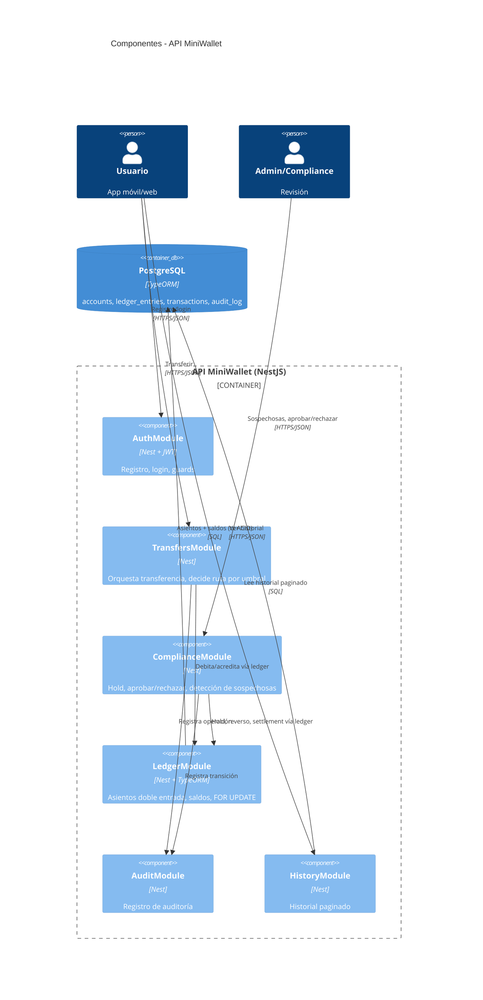

# Diagrama de Componentes — API MiniWallet (C4 nivel 3)

Abre el contenedor **API MiniWallet** en sus módulos NestJS. Solo se documenta este nivel porque **aporta valor**: es donde se ve la separación no negociable entre "settlement automático" y "hold de compliance" (`CLAUDE.md`).

## Módulos y responsabilidades

| Componente (módulo Nest) | Responsabilidad |
|---|---|
| `AuthModule` | Registro, login, emisión y validación de JWT. Guard de autenticación. |
| `TransfersModule` | Orquesta una transferencia: valida saldo, decide ruta según umbral, delega en el ledger. **No** contiene la lógica de compliance. |
| `ComplianceModule` | Camino de estado de las ≥ $1000: hold, aprobación/rechazo (endpoints admin) y detección de sospechosas. Separado de `TransfersModule` a propósito. |
| `LedgerModule` | Única puerta de escritura al dinero: crea asientos de doble entrada y actualiza los saldos materializados dentro de la transacción DB. Toma el `FOR UPDATE`. |
| `AuditModule` | Escribe `audit_log` en cada operación/transición. |
| `HistoryModule` | Consulta paginada del historial del usuario. |

## Código Mermaid (C4Component)

> Punto clave para el review: **tanto `TransfersModule` como `ComplianceModule` escriben dinero SOLO a través de `LedgerModule`**. No hay dos caminos de escritura al saldo. La separación de responsabilidades no rompe la única-puerta-al-dinero.
