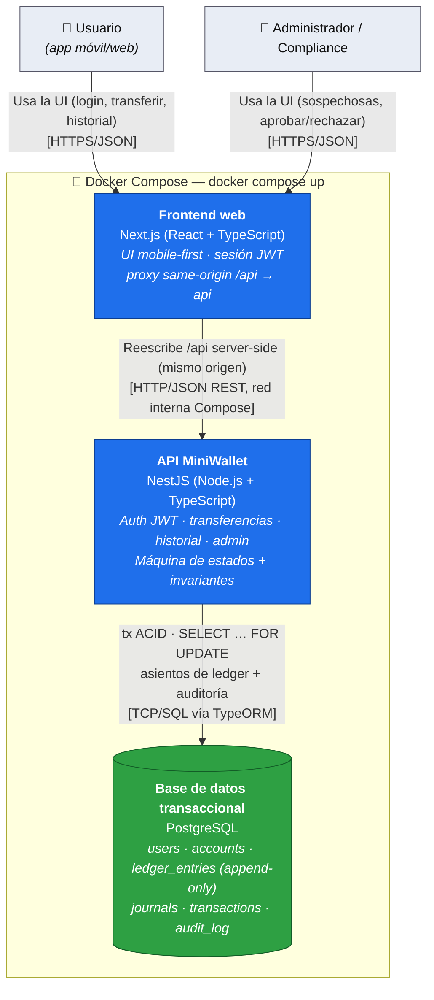

# Diagrama de Contenedores (C4 nivel 2)

Abre la caja negra de MiniWallet. Cada contenedor: **nombre · tecnología · responsabilidad**. Cada flecha: **protocolo · propósito**.

## Descripción textual (referencia)

```
  Usuario / Administrador (browser)
        │ HTTPS/JSON (usa la UI; solo habla con el mismo origen)
        ▼
  ┌─────────────────────────────────────────────────────────┐
  │  Frontend web                                           │
  │  Next.js (React + TypeScript)                           │
  │  - UI mobile-first, sesión JWT en el cliente            │
  │  - Proxy same-origin /api → api (sin CORS)              │
  └───────────────┬─────────────────────────────────────────┘
                  │ HTTP/JSON (REST) — reescritura server-side, red interna
                  ▼
  ┌─────────────────────────────────────────────────────────┐
  │  API MiniWallet                                          │
  │  NestJS (Node.js + TypeScript)                           │
  │  - Auth JWT, transferencias, historial, admin           │
  │  - Máquina de estados + validación de invariantes       │
  └───────────────┬─────────────────────────────────────────┘
                  │ TCP/SQL (TypeORM) — transacciones ACID,
                  │ bloqueo pesimista de fila, asientos de ledger
                  ▼
  ┌─────────────────────────────────────────────────────────┐
  │  Base de datos transaccional                            │
  │  PostgreSQL                                             │
  │  - users, ledger (append-only), transactions,          │
  │    audit_log                                           │
  │  - Garante de atomicidad e invariante contable         │
  └─────────────────────────────────────────────────────────┘

  Todo orquestado por Docker Compose (un solo comando: `docker compose up`).
  El back-end exigido es api + db; el frontend web es un complemento.
```

## Diagrama (Mermaid — nivel 2: Contenedores C4)



> Todo orquestado por Docker Compose (`docker compose up`). La topología de despliegue está en `deployment.md`; el detalle interno de la API en `components.md`.

## Contenedores

| Contenedor | Tecnología | Responsabilidad principal |
|---|---|---|
| **Frontend web** | Next.js (React + TypeScript) | Sirve la UI mobile-first (login, transferencia con aviso de hold ≥ $1000, historial, panel de compliance). Mantiene la sesión JWT en el cliente y **proxya `/api` server-side** a la API por la red interna de Compose (mismo origen → sin CORS). Es un consumidor puro: no mueve dinero. |
| **API MiniWallet** | NestJS (Node.js + TypeScript) | Expone el API REST. Autentica con JWT. Ejecuta la lógica de transferencia (máquina de estados, hold de compliance, validación de saldo), historial paginado y endpoints admin. Traduce errores de dominio a códigos semánticos. |
| **Base de datos transaccional** | PostgreSQL | Persiste `users`, `ledger` (asientos inmutables), `transactions` (estado) y `audit_log`. Garantiza atomicidad (transacciones ACID) y sirve el bloqueo pesimista que evita sobregiros bajo concurrencia. |
| **Orquestador** | Docker Compose | Levanta web + API + DB con un comando. No es un contenedor de negocio; es la restricción técnica del enunciado (despliegue reproducible). El **back-end** (`api` + `db`) es lo exigido; el `web` es un complemento. |

## Flechas (interacciones)

| Origen → Destino | Protocolo | Propósito |
|---|---|---|
| Usuario → Frontend web | HTTPS / JSON | Usar la UI: login, transferir, consultar historial. El browser solo habla con el mismo origen. |
| Administrador → Frontend web | HTTPS / JSON | Usar la UI admin: consultar sospechosas, aprobar/rechazar retenidas. |
| Frontend web → API MiniWallet | HTTP / JSON (REST, red interna) | El servidor Next reescribe `/api/*` a la API (proxy same-origin); reenvía el `Authorization: Bearer`. Evita CORS sin tocar el backend. |
| API MiniWallet → PostgreSQL | TCP / SQL (vía TypeORM) | Leer/escribir dentro de transacciones ACID; tomar bloqueo pesimista de la fila del emisor; escribir asientos de ledger y auditoría. |

## Justificación de la tecnología (por qué cada elección)

| Elección | Justificación (1–2 líneas) |
|---|---|
| **Next.js (frontend)** | RF1 pide app "móvil **o web**"; se agregó una web mobile-first. Next.js sirve la SPA y, con `rewrites`, hace de **proxy same-origin** hacia la API → resuelve CORS sin tocar el backend. Es un complemento; el back-end sigue siendo lo exigido. |
| **NestJS** | Framework opinado sobre Node/TS: DI, capas y módulos que empujan a una arquitectura limpia y testeable — clave cuando el 25% de la nota es calidad de código y hay lógica transaccional que aislar. Soporte de primera para interceptores/filtros → manejo de errores semánticos centralizado. |
| **PostgreSQL** | El requisito duro es "nunca perder ni duplicar dinero" bajo concurrencia. Postgres da transacciones ACID serias, `SELECT … FOR UPDATE` para el bloqueo pesimista, y `NUMERIC` exacto para dinero. Una base NoSQL no daría estas garantías sin reimplementarlas a mano. |
| **TypeORM** | ORM nativo del ecosistema Nest; permite manejar transacciones y locks pesimistas de forma explícita sin perder control del SQL crítico. El trade-off (ORM vs. SQL crudo) se documenta en `DECISIONS.md`. |
| **Docker Compose** | Lo exige el enunciado: sistema completo con un solo comando. Reproducibilidad del entorno API+DB sin pasos manuales. |

> Nota de escalabilidad (detalle en `README.md` → "Cómo escalaría"): este diseño es un solo nodo de API + una DB. El camino de escala es API stateless replicable detrás de un balanceador, y en la DB pasar de lock pesimista a particionamiento/sharding por cuenta o a colas para el flujo de compliance. No se implementa en esta versión.
