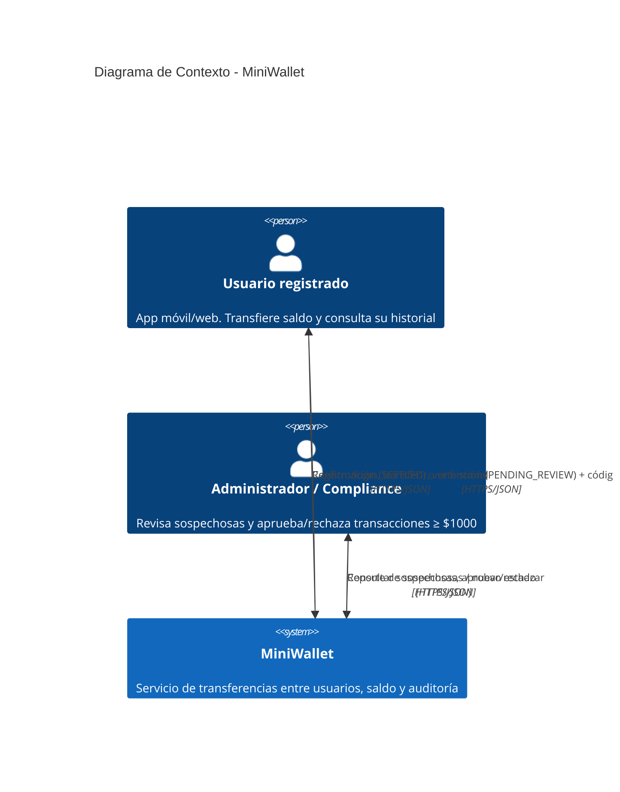

# Diagrama de Contexto (C4 nivel 1)

Sistema como **caja negra**: actores externos y qué entra/sale. No muestra tecnología interna (eso es el diagrama de contenedores).

## Descripción textual (referencia)

```
        ┌──────────────────────────┐
        │   Usuario registrado     │
        │  (app móvil o web)       │
        └───────────┬──────────────┘
                    │  (1) Registro / login (JWT)
                    │  (2) Transferir saldo
                    │  (3) Consultar historial paginado
                    ▼
        ┌──────────────────────────────────────────┐
        │                                          │
        │            MiniWallet (SUT)              │
        │   Servicio de transferencias entre       │
        │   usuarios + saldo + auditoría           │
        │                                          │
        └───────────▲──────────────────────────────┘
                    │  (4) Consultar transacciones sospechosas
                    │  (5) Aprobar / rechazar transacción ≥ $1000
        ┌───────────┴──────────────┐
        │  Administrador /         │
        │  Compliance              │
        └──────────────────────────┘
```

## Código Mermaid (C4 — nivel 1: Contexto)



> **Nota de notación:** se usa C4 nativo de Mermaid (estándar de la casa, ver `DECISIONS.md` ADR-007). Si el destino de render no soporta bien `C4Context`, la descripción textual de arriba es el fallback fiel.

## Actores y flujos

| # | Actor | Entra al sistema | Sale del sistema |
|---|---|---|---|
| 1 | Usuario registrado | Credenciales de registro/login | Token JWT |
| 2 | Usuario registrado | Orden de transferencia (receptor, monto) | Confirmación (`SETTLED`) **o** aviso de retención (`PENDING_REVIEW`) + código semántico |
| 3 | Usuario registrado | Petición de historial (página, tamaño) | Lista paginada de movimientos |
| 4 | Administrador / Compliance | Petición de transacciones sospechosas (filtros) | Lista de transacciones que cumplen criterios C1–C4 |
| 5 | Administrador / Compliance | Decisión sobre una transacción retenida | Nuevo estado (`APPROVED` / `REJECTED`) + asiento contable |

## Frontera del sistema (qué NO cruza esta caja)

- **No hay proveedor de pagos / banco externo.** El saldo es interno (ver `CONTEXT.md`, S1). Por eso el diagrama de contexto **no** tiene un actor "sistema bancario" ni "gateway de pagos".
- **No hay proveedor KYC/AML externo.** La validación de compliance es interna y manual (S2). El actor "Compliance" es humano, no un sistema tercero.
- Se dibuja así **a propósito**: agregar esas cajas sería inventar requisitos que el enunciado no pide. La frontera queda lista para enchufarlos después (ver `DECISIONS.md`).
