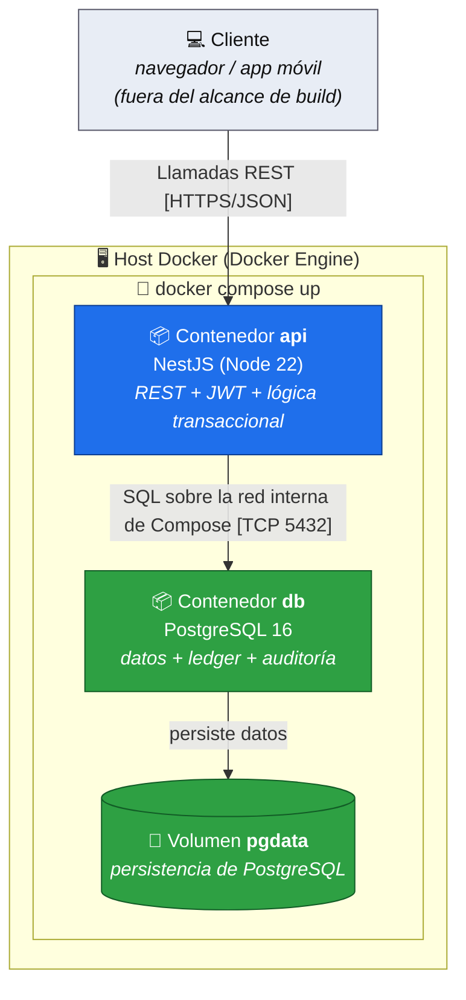

# Diagrama de Deployment — MiniWallet (C4 nivel 4)

Topología de despliegue. Cumple la restricción técnica: todo el back-end levanta con `docker compose up`.

## Diagrama (Mermaid — Deployment)

## Notas de despliegue

- **Un solo comando:** `docker compose up` levanta `api` + `db` en la red interna de Compose. La API espera a que la DB esté healthy (`depends_on` + healthcheck) antes de aceptar tráfico.
- **Persistencia:** un volumen `pgdata` sobrevive al reinicio de contenedores. El estado no se pierde entre `up`/`down`.
- **Configuración:** credenciales de DB y secreto JWT vía variables de entorno (`.env`), nunca hardcodeadas (ver `BUILD_CONVENTIONS.md`).
- **Un solo nodo (alcance actual):** una instancia de API + una de DB. El camino a alta disponibilidad está en `RISKS_AND_SCALABILITY.md`, no se implementa en esta versión.
