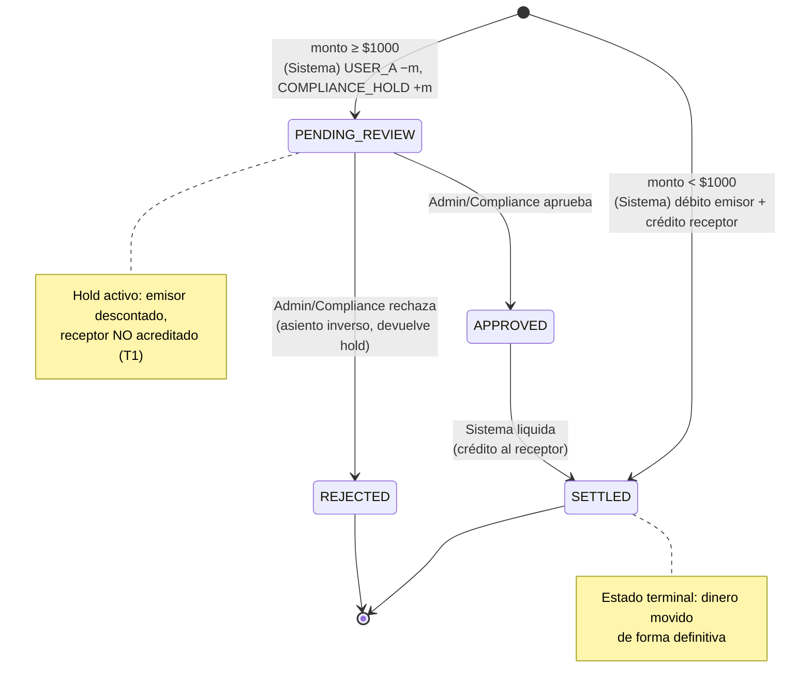

# DOMAIN_SPEC — MiniWallet

Fuente de verdad del modelo de dominio (declarada no renegociable en `CLAUDE.md`). Cualquier cambio de comportamiento se refleja acá **antes** de tocar código.

Depende de: `CONTEXT.md` (actores, alcance, supuestos S1–S10).

---

## 1. Tensiones y requisitos con matices ocultos

El enunciado esconde tensiones que hay que resolver explícito. Cada una: **qué dice → qué esconde → cómo la resolvemos**.

### T1 — "Inmediato" vs. "requiere validación" (la tensión central)

> *"Las transferencias deben reflejarse inmediatamente… Sin embargo, toda transacción mayor a $1,000 USD debe pasar por un proceso de validación antes de confirmarse."*

- **Qué esconde:** "inmediato" y "validación previa" son contradictorios si existe **un solo** concepto de saldo. No se puede reflejar algo al instante *y* retenerlo para validar sobre el mismo número.
- **Resolución:** se parte el saldo en dos conceptos (§3) y se introduce un **estado intermedio** de transacción (§2). Para montos ≥ $1000:
  - Se **descuenta el saldo disponible del emisor al instante** → cumple "reflejo inmediato" desde la óptica del emisor y **evita doble gasto** durante la revisión (supuesto S6).
  - **No** se acredita al receptor hasta la aprobación → cumple "validación antes de confirmar".
  - El dinero retenido vive como **saldo pendiente/contable**, no disponible.
- **Por qué así:** es la lectura que respeta *ambas* frases del enunciado sin violar la invariante contable. El dinero nunca "desaparece": mientras está en hold, está reflejado en el ledger como asiento pendiente, no perdido.

### T2 — "Atómica: nunca perder ni duplicar dinero"

- **Qué esconde:** atomicidad no es solo `BEGIN/COMMIT`. Con concurrencia, dos débitos simultáneos sobre el mismo saldo pueden ambos leer el saldo viejo y sobregirar (lost update).
- **Resolución:** toda transferencia es **una transacción DB** que (a) toma bloqueo sobre la fila del emisor, (b) valida saldo, (c) escribe los asientos de ledger, (d) commitea. Ver §5. Nunca se hace `UPDATE balance = balance - x` suelto.
- **Invariante que lo garantiza:** `sum(débitos) == sum(créditos)` en todo el ledger, siempre.

### T3 — "Reflejarse inmediatamente" para < $1000

- **Qué esconde:** ¿el receptor también ve el dinero al instante?
- **Resolución (S5):** sí. Montos < $1000 van directo a `SETTLED`: débito al emisor y crédito al receptor impactan `balance_available` de ambos en la misma transacción.

### T4 — "Transacción sospechosa" (concepto a definir)

- **Qué esconde:** el enunciado delega la definición. Sin criterios concretos, el endpoint admin es decorativo.
- **Resolución:** criterios heurísticos explícitos y justificados en §4.

### T5 — Umbral exacto de $1000

- **Qué esconde:** "mayor a" es ambiguo (`>` vs `>=`) y el tipo de dato importa (float rompe la comparación).
- **Resolución (S4, S7):** dinero en **`NUMERIC(20,2)`** (exacto, nunca float); umbral `amount >= 1000.00`. Decisión reversible documentada en `DECISIONS.md` (ADR-003, ADR-006).

---

## 2. Máquina de estados de la transacción

Una **transacción** (transfer) es la entidad con ciclo de vida. Los asientos de ledger son inmutables (append-only); la transacción es lo que transiciona.

### Estados

| Estado | Significado | ¿Emisor descontado? | ¿Receptor acreditado? |
|---|---|---|---|
| `PENDING_REVIEW` | Monto ≥ $1000, esperando decisión de compliance. Hold activo sobre el emisor. | Sí (hold sobre disponible) | No |
| `APPROVED` | Compliance aprobó. Listo para liquidar. Estado transitorio hacia `SETTLED`. | Sí | No todavía (se acredita al pasar a SETTLED) |
| `REJECTED` | Compliance rechazó. Se revierte el hold al emisor. Estado terminal. | No (revertido) | No |
| `SETTLED` | Transferencia confirmada y liquidada. Dinero movido de forma definitiva. | Sí | Sí |

> `APPROVED` y `SETTLED` se separan a propósito: la **decisión** de compliance y la **liquidación contable** son dos pasos distintos (la regla del proyecto prohíbe mezclar "settlement automático" con "hold de compliance" en el mismo método). En la práctica `APPROVED → SETTLED` puede ser inmediato, pero son transiciones separadas y auditables por separado.

### Tabla de transiciones

| Estado origen | Transición → destino | Disparador (quién/qué) | Efecto contable |
|---|---|---|---|
| *(inicio)* | → `SETTLED` | **Sistema**, cuando monto < $1000 | Journal: `USER_A −m`, `USER_B +m`. Suma cero. |
| *(inicio)* | → `PENDING_REVIEW` | **Sistema**, cuando monto ≥ $1000 | Journal: `USER_A −m`, `COMPLIANCE_HOLD +m`. El dinero pasa a la cuenta de sistema HOLD, **no** al receptor. Suma cero. |
| `PENDING_REVIEW` | → `APPROVED` | **Administrador/Compliance** (endpoint admin) | Ninguno todavía (solo marca la decisión). |
| `PENDING_REVIEW` | → `REJECTED` | **Administrador/Compliance** (endpoint admin) | Journal: `COMPLIANCE_HOLD −m`, `USER_A +m`. Devuelve el hold al emisor. Suma cero. |
| `APPROVED` | → `SETTLED` | **Sistema** (liquidación) | Journal: `COMPLIANCE_HOLD −m`, `USER_B +m`. HOLD libera al receptor. Suma cero. |

> Cada journal balancea a cero por sí solo (invariante #3, §7). El hold **no** es un débito sin contraparte: su crédito va a la cuenta de sistema `COMPLIANCE_HOLD` (ver `DATA_MODEL.md` §2-§3).

### Diagrama de estados (Mermaid)

### Transiciones inválidas (deben rechazarse con error semántico)
- `SETTLED → *` (terminal). Error: `TRANSACTION_ALREADY_SETTLED`.
- `REJECTED → *` (terminal). Error: `TRANSACTION_ALREADY_REJECTED`.
- `APPROVED → REJECTED` o `APPROVED → PENDING_REVIEW` (no se puede des-aprobar). Error: `INVALID_STATE_TRANSITION`.
- Aprobar/rechazar una transacción que ya no está en `PENDING_REVIEW`. Error: `TRANSACTION_NOT_PENDING_REVIEW`.

---

## 3. Saldo disponible vs. saldo pendiente

Todo **derivado del ledger**, nunca editado a mano. El único saldo **almacenado** (como caché) es el disponible; el resto son vistas computadas.

| Concepto | Definición | De dónde sale |
|---|---|---|
| `balance_available` | Lo que el usuario **puede gastar ahora**. Es sobre lo que se valida al iniciar una transferencia. | `balance` de su cuenta `USER` (caché recalculable = suma de sus asientos en `ledger_entries`). |
| `pendiente_saliente` | Dinero **suyo** retenido en `COMPLIANCE_HOLD` esperando revisión (podría volverle si se rechaza). | `SUM(amount)` de sus transacciones en `PENDING_REVIEW` como emisor. |
| `pendiente_entrante` | Dinero que le **entraría** si se aprueba, todavía no disponible. | `SUM(amount)` de sus transacciones en `PENDING_REVIEW` como receptor. |
| `balance_contable` | Foto contable total del usuario. | `balance_available + pendiente_saliente` (lo que aún le es atribuible hasta que se resuelva el hold). |

**Regla clave:** un monto en hold (`PENDING_REVIEW`) ya **salió** del `balance_available` del emisor (fue debitado a `COMPLIANCE_HOLD`) pero **todavía no entró** al del receptor. No está perdido: vive en la cuenta de sistema `COMPLIANCE_HOLD`. El balance de esa cuenta, en todo momento, es exactamente la suma de todos los holds activos.

**Invariantes** (ver §7): `SUM(balance)` sobre TODAS las cuentas (incluida `SYSTEM_FUNDING`, que va negativa) = `0`; ninguna cuenta `USER`/`COMPLIANCE_HOLD` queda negativa; cada journal balancea a cero.

---

## 4. Definición de "transacción sospechosa"

El enunciado pide definirla. No es un motor AML real (out of scope, ver `CONTEXT.md`); son **heurísticas explicables**. El endpoint admin devuelve las transacciones que cumplen **al menos uno** de estos criterios.

| # | Criterio | Umbral concreto | Por qué es señal de sospecha |
|---|---|---|---|
| C1 | **Monto alto** | Transferencia ≥ $1000 (las que ya pasaron por `PENDING_REVIEW`). | Es el propio umbral de compliance del enunciado: montos materiales concentran el riesgo regulatorio. |
| C2 | **Velocity / ráfaga** | Un mismo emisor con **≥ N transferencias en una ventana corta** (ej. ≥ 5 en 1 minuto). | Patrón típico de *structuring* (fraccionar para evadir el umbral) o de cuenta comprometida operando en automático. |
| C3 | **Fraccionamiento bajo el umbral** | Varias transferencias **justo por debajo** de $1000 (ej. entre $900 y $999) del mismo emisor en ventana corta, que sumadas superan $1000. | Es la contracara de C1: evadir la revisión partiendo el monto. Detectarlo es el punto de definir "sospechosa" con criterio, no solo copiar el umbral. |
| C4 | **Vaciado de cuenta** | Transferencia que deja el `balance_available` del emisor en ~0 (ej. ≥ 95% del saldo). | Patrón de cuenta tomada: el atacante saca todo de una. |

**Justificación del diseño de los criterios:** C1 es trivial pero obligatorio (es el umbral del negocio). El valor real está en **C2 y C3**, que detectan intentos de **evadir** C1 — que es exactamente lo que un motor de compliance debe buscar. Los umbrales (`N`, ventana, %) se dejan como **parámetros configurables**, no hardcodeados, porque el "nivel correcto" es una decisión de política de negocio, no de ingeniería (se documenta en `DECISIONS.md` como `[PENDIENTE]`).

> El endpoint **no** decide ni bloquea: solo **reporta** para revisión humana. Marcar como sospechosa ≠ rechazar. Esa separación (detección vs. acción) es deliberada.

---

## 5. Concurrencia (cómo se cumple "atómica" bajo carga)

Requisito no funcional: múltiples usuarios transfiriendo en simultáneo, sin perder ni duplicar dinero.

**Escenario de riesgo:** emisor con $100. Dos transferencias de $80 concurrentes. Sin control, ambas leen $100, ambas validan OK, ambas debitan → saldo −$60. Sobregiro. Dinero duplicado.

**Estrategia:** dentro de la transacción DB de una transferencia:
1. **Bloqueo pesimista** sobre la fila del emisor (`SELECT … FOR UPDATE` o equivalente). La segunda transferencia concurrente **espera** a que la primera commitee.
2. Recién con el lock tomado, se **relee** el `balance_available` y se valida.
3. Si no alcanza → `INSUFFICIENT_BALANCE` y rollback.
4. Si alcanza → asientos de ledger + commit → se libera el lock.

**Por qué pesimista y no optimista:** en el hot path de "debitar saldo", el conflicto sobre la misma cuenta es esperable (no raro), y una falla de sobregiro es **inaceptable** (no reintentar-friendly). El lock pesimista da la garantía dura más simple de razonar. Trade-off (menor concurrencia sobre la *misma* cuenta) se documenta en `DECISIONS.md`. Transferencias entre cuentas **distintas** no se bloquean entre sí.

> Detalle de deadlock: si A→B y B→A ocurren a la vez y se lockean cuentas en orden distinto, hay riesgo de deadlock. Mitigación: **tomar los locks siempre en un orden determinístico** (ej. por id ascendente de cuenta). Documentado como decisión de build.

---

## 6. Trazabilidad y errores

- **Auditoría:** toda operación financiera y toda transición de estado registra: quién, cuándo, qué cambió, estado anterior → estado nuevo. Tabla append-only.
- **Errores semánticos:** códigos de negocio propios además del status HTTP. Catálogo mínimo:

| Código | HTTP | Cuándo |
|---|---|---|
| `INSUFFICIENT_BALANCE` | 422 | El emisor no tiene saldo disponible suficiente. |
| `TRANSACTION_PENDING_REVIEW` | 202 / 409 | La transferencia quedó retenida por compliance (informativo, no error duro). |
| `TRANSACTION_NOT_PENDING_REVIEW` | 409 | Se intentó aprobar/rechazar algo que no está en `PENDING_REVIEW`. |
| `INVALID_STATE_TRANSITION` | 409 | Transición no permitida por la máquina de estados. |
| `TRANSACTION_ALREADY_SETTLED` | 409 | Operar sobre una transacción terminal liquidada. |
| `TRANSACTION_ALREADY_REJECTED` | 409 | Operar sobre una transacción terminal rechazada. |
| `SELF_TRANSFER_NOT_ALLOWED` | 422 | Emisor == receptor. |
| `RECEIVER_NOT_FOUND` | 404 | El receptor no existe. |
| `UNAUTHORIZED` | 401 | JWT ausente/ inválido/ expirado. |
| `IDEMPOTENCY_KEY_CONFLICT` | 409 | Se reusó una `Idempotency-Key` con parámetros distintos (ver §8). |

> Un reintento con la **misma** key y **mismos** params no es error: devuelve el resultado original (idempotencia, §8).

---

## 7. Validador de consistencia contable (gate de "feature terminada")

Los **tres invariantes universales** de un ledger de doble entrada (skill `ledger-accounting-validator`). Toda feature que toque dinero debe pasarlos:

1. **Conservación (balance global cero):** `SUM(amount)` de TODAS las `ledger_entries` = `0`, equivalente a `SUM(balance)` sobre todas las cuentas (incluida `SYSTEM_FUNDING` negativa) = `0`. Si no cuadra, se creó o destruyó dinero.
2. **No-negatividad donde aplica:** ninguna cuenta `USER` ni `COMPLIANCE_HOLD` quedó negativa. (`SYSTEM_FUNDING` puede serlo por diseño.)
3. **Cada journal balancea individualmente:** `SELECT journal_id FROM ledger_entries GROUP BY journal_id HAVING SUM(amount) <> 0` debe devolver **cero filas**. Un global correcto con journals rotos = dos bugs cancelándose.

Comprobaciones adicionales de dominio:
4. Toda transacción tiene un estado válido según §2 (sin estados huérfanos ni transiciones inválidas persistidas).
5. El `accounts.balance` cacheado coincide con la reconstrucción desde `ledger_entries` (sin deriva).

> **CRÍTICO (skill):** estos invariantes **solo demuestran algo si se verifican después de carga concurrente adversarial**, no una sola vez en orden secuencial. Ver `TEST_PLAN.md` §4/§7.

---

## 8. Idempotencia (requisito de dominio, no optimización)

Un cliente que reintenta un POST de transferencia (timeout de red) **no debe** duplicarla. Regla de la skill: la `Idempotency-Key` la genera el **cliente** (si la generara el server, un timeout + reintento daría otra key y la protección no serviría).

- La transferencia recibe header `Idempotency-Key` (obligatorio en `POST /transfers`).
- Dedup vía tabla `idempotency_keys` (ver `DATA_MODEL.md` §5), dentro de la misma transacción DB de la transferencia.
- Reintento con **misma key + mismos params** → devuelve el resultado original, sin re-ejecutar.
- **Misma key + params distintos** → `IDEMPOTENCY_KEY_CONFLICT`.
- Scope de la key: por usuario emisor.
